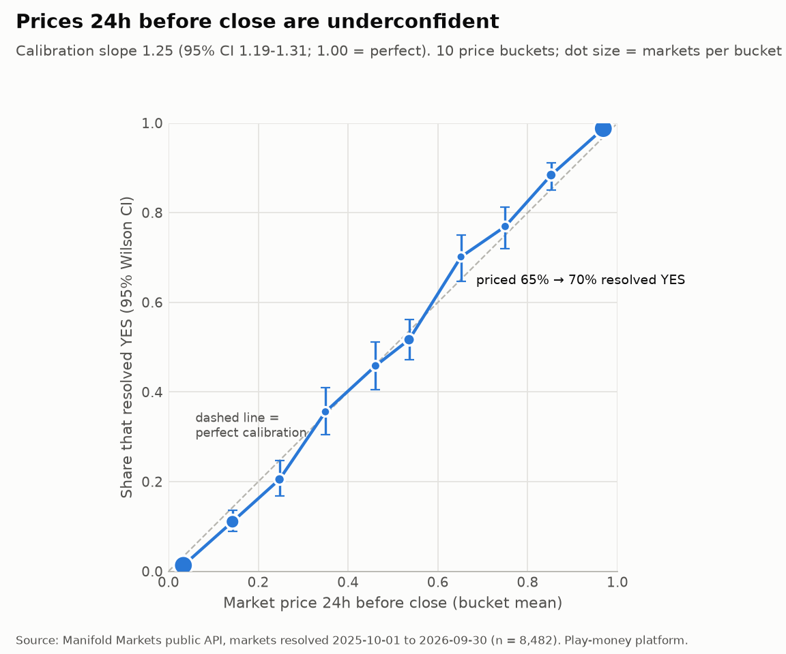
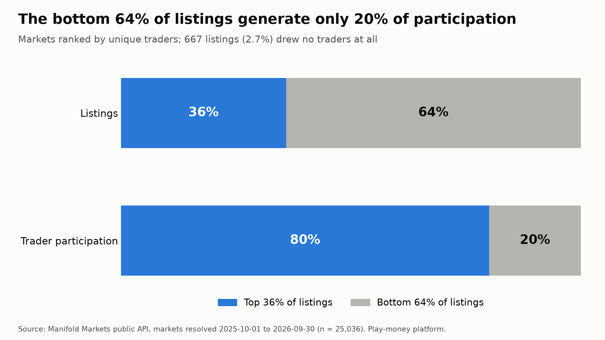
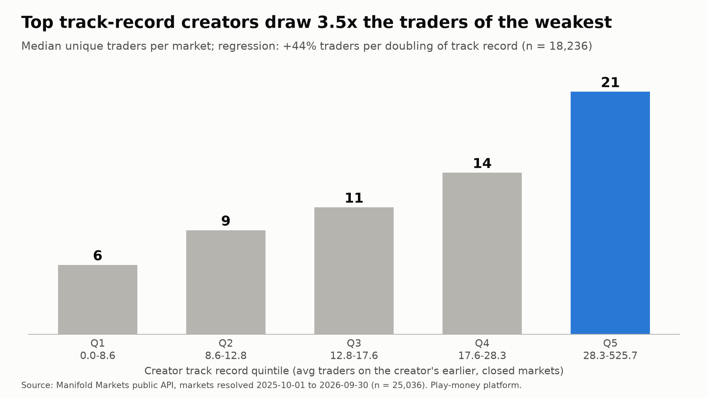
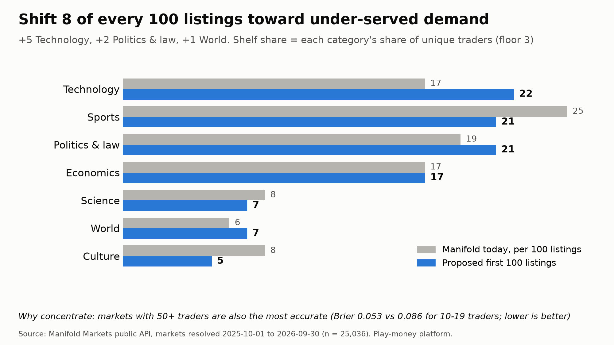

# What should a new prediction exchange list first?

[](https://github.com/pedroloopezz/prediction-market-growth/actions/workflows/ci.yml)

I'm co-founding Piq, a prediction market launching in Brazil, and wanted to know what a new exchange should list first.

This repo answers that with data: a reproducible pipeline (public API → Parquet → DuckDB → SQL models → statistics) over **25,036 Manifold markets resolved Oct 2025 – Sep 2026**, ending in a one-page client memo: [**reports/memo.md**](reports/memo.md).

**The question.** *Growth:* what drives engagement on an event-contract exchange, how concentrated is it, and how should a new exchange allocate its first listings? *Pricing (supporting):* can market prices be trusted as probabilities, and where are they systematically wrong?

## Headline findings: list fewer, better markets

1. **Curate the long tail.** The bottom 64% of listings generate only 20% of trader participation; the top 36% generate 80%. 667 listings (2.7%) drew no traders at all.
2. **Back proven creators.** Each doubling of a creator's track record (average traders on their earlier, already-closed markets) goes with +44% traders (95% CI +34% to +55%). Sheer listing experience doesn't help: holding track record fixed, 10x more prior markets goes with −15% traders.
3. **Concentrate liquidity and rebalance the mix.** Markets with 50+ traders have the most accurate prices (Brier 0.053 vs. 0.086 for 10–19 traders). Weighting the first 100 listings by engagement shifts 8 of every 100 from Manifold's current mix: +5 Technology, +2 Politics & law, +1 World. More Technology and less Culture hold under volume weighting too; volume weighting flips Sports (28 of 100 vs. 25 today), the engagement vs. fee-revenue trade-off to test.

**Pricing.** Prices a day before close are informative (Brier 0.075 vs. 0.225 for always guessing the base rate) but underconfident: long shots are overpriced and favorites underpriced (calibration slope 1.25, 95% CI 1.19–1.31). The bias holds out of sample (slope 1.15 on the latest 30% of markets) but recalibrating doesn't beat the raw price there. The direction matches published real-money evidence from Kalshi and Polymarket; see [docs/real_money_comparison.md](docs/real_money_comparison.md), with page references.



| Rec 1: long tail | Rec 2: creators | Rec 3: first 100 listings |
|---|---|---|
|  |  |  |

## Reproduce it

Requires Python 3.11+. No API keys.

```bash
git clone https://github.com/pedroloopezz/prediction-market-growth.git && cd prediction-market-growth
python3.11 -m venv .venv && source .venv/bin/activate
pip install -e ".[dev]"
python -m pipeline.run_all
```

`run_all` ingests from Manifold's public API (incrementally), builds the warehouse, runs both analyses, regenerates every chart and `reports/results.json`, and finishes with the test suite.
- **First run:** about 2.5 hours, almost all of it rate-limited API calls (we stay at ≤ 400 requests/minute; Manifold allows 500).
- **Re-running from the data already on disk:** `python -m pipeline.run_all --skip-ingest` takes about 10 seconds.

**Why `data/` isn't in the repo.** Manifold's terms allow personal, non-commercial use through its public API but not redistributing compiled datasets, so raw and processed data are gitignored and rebuilt by the command above. The numbers here come from the snapshot taken on Oct 5, 2026. The analysis window is fixed, so a later run should land very close, but it can differ slightly (markets can be deleted or re-resolved after the fact).

## How it works

`ingest/` (httpx client with rate limiting, retries with exponential backoff, cursor pagination, pydantic validation) → raw Parquet partitioned by run date → `warehouse/sql/` (staging and mart models in DuckDB, plus a reviewable topic-to-category seed CSV) → `analysis/` (statsmodels) → `reports/`. Diagram in [docs/architecture.md](docs/architecture.md); every design choice and its alternatives are in [docs/decisions.md](docs/decisions.md).

## Data-quality checks (pytest, on the built warehouse) and why each exists

| Check | Why |
|---|---|
| **Look-ahead guard:** every price comes from a bet strictly before its horizon, and every horizon is strictly before close | A price observed at or after resolution drifts to 0 or 1 and fakes perfect calibration |
| Creator track record recomputed by brute force on a random sample | Proves the supply-side variable uses only markets closed *before* each market opened (no leakage) |
| `market_key` unique and not null | Duplicates would double-count listings in every share and Pareto calculation |
| `result` ∈ {0, 1}, and only for binary YES/NO | Calibration needs a clean outcome; cancelled and multi-outcome markets must stay out |
| Prices within [0, 1] | A probability outside it means a parsing or unit error |
| Close after open, duration > 0 | `log(duration)` in the model; caught 5 creator data-entry errors and a whole-second truncation bug |
| Every price row joins to a market; every eligible binary market has both horizons | Orphan prices mean wrong ids; missing prices would mean silent sampling |
| Mart inside the window; every market has details and a category | Missing details would silently push markets into "Uncategorized" |
| Categories come from the agreed list; the robustness ordering only moves Economics → Politics & law | A seed-file typo can't create a category; caught a real bug in the first robustness version |
| Row counts logged per build | Audit trail for every run |
| Every number in the memo matches `results.json` | The memo can't drift from the code |

There are also parser tests on saved API samples, client tests (retries, pagination) against a fake transport, and unit tests for the concentration, allocation and scoring math.

## Limitations

- **Manifold only, and play money.** Incentives differ from a real-money exchange; notably, prices don't converge to calibration near close the way Kalshi's do.
- **Manifold's audience is tech- and AI-heavy,** which likely drives Technology's lead. The transferable lesson is the method (align listings with *your* users' demand), not "list tech".
- **Only resolved markets** in a 12-month window.
- **The growth results are correlational.** Track record may capture a creator's audience rather than skill.
- **"Participation" sums unique traders per market,** so a person trading ten markets counts ten times; distinct users per category aren't available from the API.
- **Categories map about 300 user topics** to Manifold's top-level categories (86% coverage). Results hold under an alternate category ordering.
- **The uncertainty variable in the engagement model is likely mechanical** (an untraded market sits at its starting price), so it isn't used for recommendations.
- **No sampling:** every eligible market was priced.

## Next steps at scale

- **Storage:** Postgres or Snowflake instead of local DuckDB.
- **Models:** dbt for the SQL, with these tests as dbt tests.
- **Scheduling:** Airflow or Dagster.
- **Ingest:** incremental loads keyed on `lastUpdatedTime` instead of a daily full snapshot.
- **CI:** also run the data-quality suite in CI against a small fixture warehouse (CI today runs ruff and pytest on the saved samples and committed results).
- **Real-money data:** run the same analysis on licensed real-money data and, above all, on the client's own first weeks of traffic.

## Repo map

```
pipeline/ingest/      manifold_client.py, models.py, run.py
pipeline/warehouse/   sql/*.sql, seeds/topic_categories.csv, build.py
pipeline/analysis/    demand.py (growth), calibration.py (pricing), slides.py, common.py
pipeline/run_all.py   one command, end to end
tests/                parsers, client, data quality, analysis math, reported numbers
reports/              memo.md, results.json, figures/
docs/                 decisions.md, architecture.md, real_money_comparison.md
```
