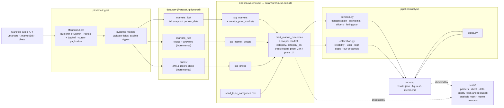

# Architecture

**One command:** `python -m pipeline.run_all` runs ingest → warehouse build → analyses → slide charts → tests. `--skip-ingest` rebuilds everything from the raw Parquet on disk in about 10 seconds.

**Idempotency.** The lite snapshot is written once per run date (an atomic directory swap). Full markets and prices are incremental, keyed on market id and (market id, horizon), and flushed every 500 items, so an interrupted run resumes where it stopped. Every run writes a manifest with its `run_id` and row counts to `data/raw/_runs/`, and every warehouse build logs row counts to `_build_log`.

**What changes at scale.**

| Layer | Now | At scale |
|---|---|---|
| Storage | Local DuckDB | Postgres or Snowflake |
| SQL models | Plain SELECTs run in order by `build.py` | dbt, with the pytest checks as dbt tests |
| Orchestration | `run_all` | Airflow or Dagster |
| Loads | Daily full snapshot | Incremental, keyed on `lastUpdatedTime` |
| CI | Tests run locally | CI on every push |
